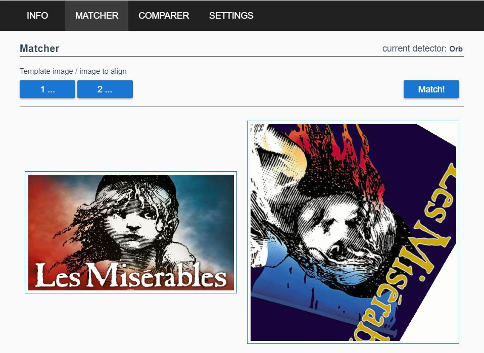

# ImgAlign

An spa to align an image to a template image. It uses a custom opencv version (compiled to wasm) to do so.
To align the image 2d-feature detection is used (orb, sift, kaze, etc).

## Built With

* [Vue](https://vuejs.org/) - The web framework used
* [Vuex](https://vuex.vuejs.org/) - Vue store
* [Vuetify](https://vuetifyjs.com) - Vue Material Design Component Framework
* [OpenCV](https://opencv.org/) - Open Source Computer Vision Library
* [WebAssembly](https://webassembly.org/) - Binary instruction format for a stack-based virtual machine

## Getting Started

### Prerequisites

* [NPM/Node](https://www.npmjs.com/get-npm) - NPM and Node.js

### Build instructions

* npm run build / npm run serve

Optionally opencv can be built:
* Install <a href="https://kripken.github.io/emscripten-site/docs/getting_started/downloads.html">emsdk</a> and make it available on the command line.
* Install python and make it available on the command line.
* Run build_opencv.sh, this will create an opencv wasm version and copies it to the public folder of the spa. 

## Deployment

## Contributing

## Versioning

## Authors

## License

## Acknowledgments

## Screenshots

  

  

  

  

