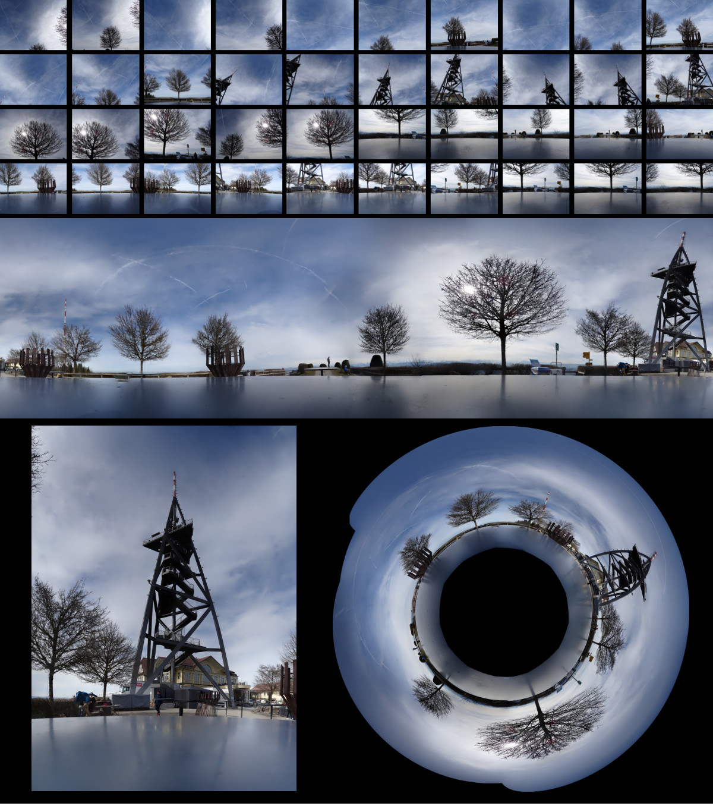
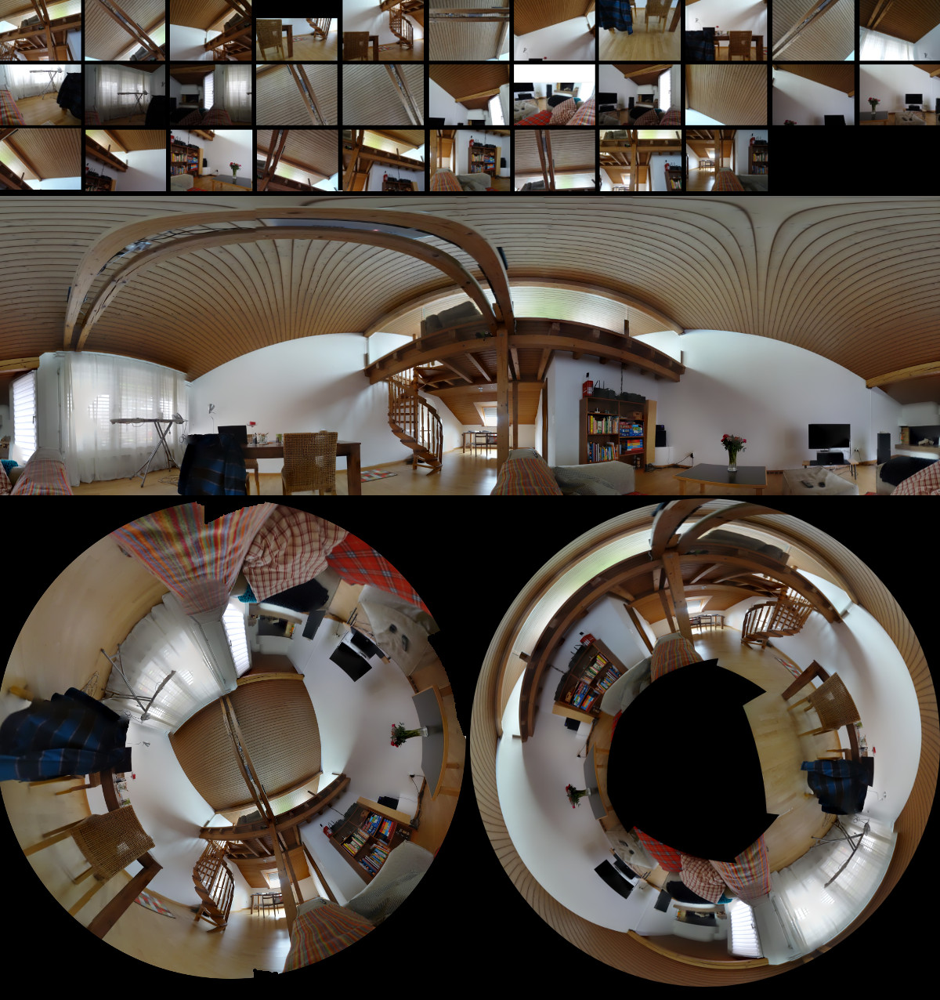
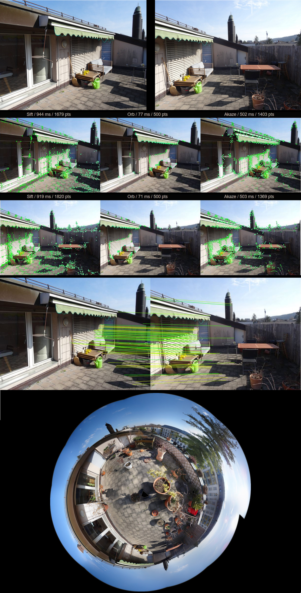
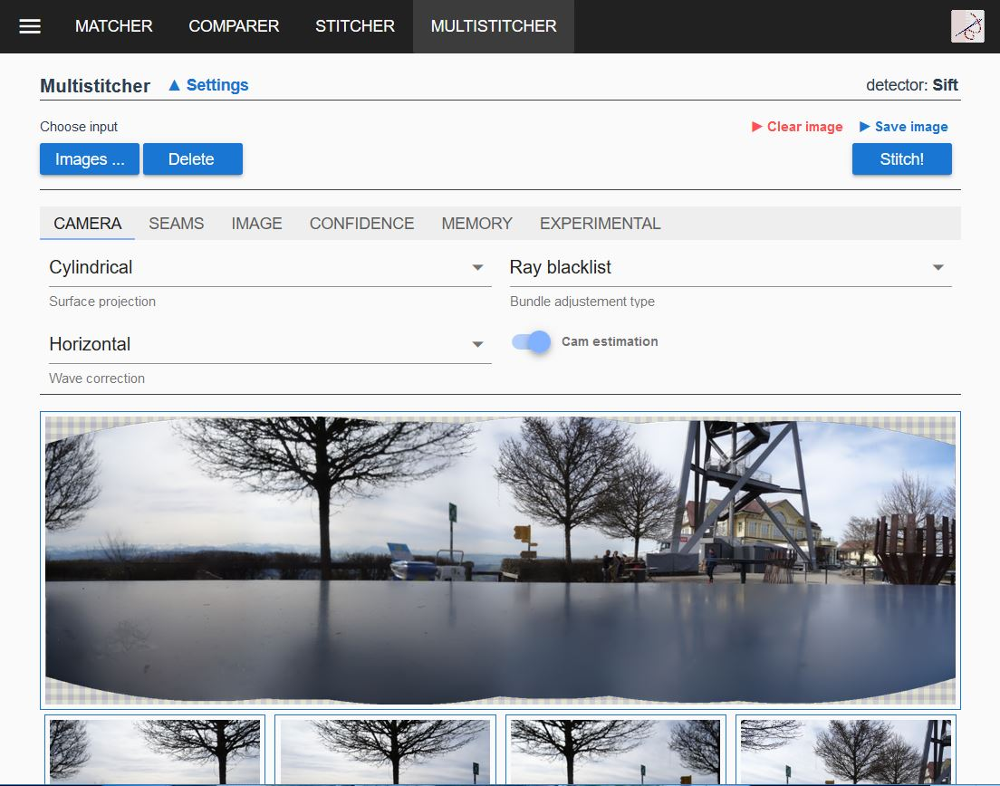
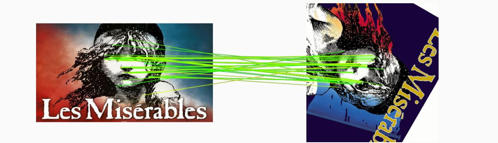
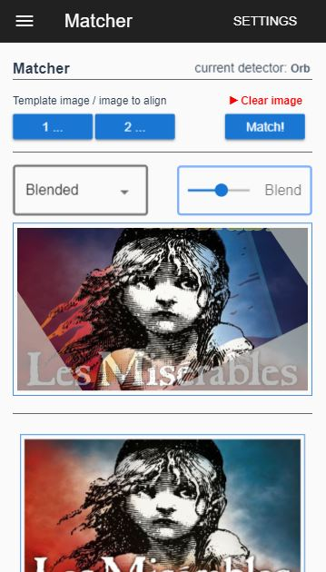
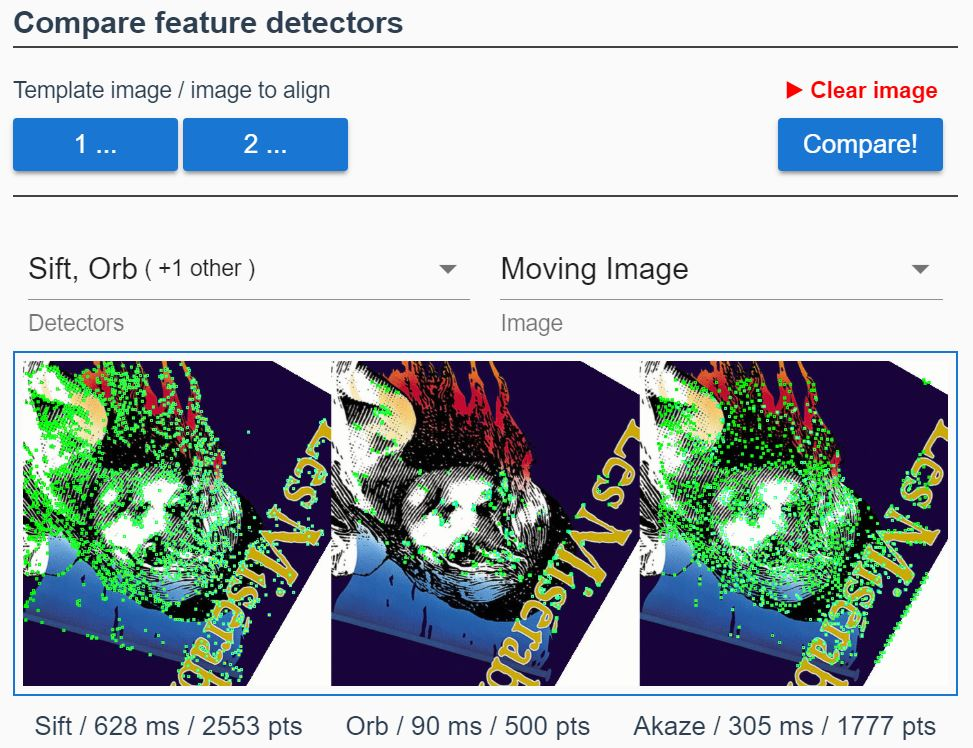

# ImgAlign

A client-side only webapplication to join, stitch or align overlapping images. It can be used to create panoramas or to align images, for example forms which have not been scanned properly.

Features: Surface projection, feature detection, feature matching, bundle adjustement, wave correction, color transfer, seam detection and multiband blending.

The core algorithms are taken from OpenCV (modules Feature2D and Stitching mainly) and have been adjusted where needed. A customized version of OpenCV has then been compiled to wasm. To ensure a non blocking UI, all OpenCV related functions run via a webworker.

Pros and cons: As image stitching can be quite memory and cpu intensive, there are some limitations on the amount or size of images which can be stitched together, especially on mobile devices. On the plus side, basic stitching functionality is available on almost any device which can run a browser. There is no need to download a professional stitching software. The application is fully functional offline as well.

## Built With

* [Vue](https://vuejs.org/) - The web framework used
* [Vuex](https://vuex.vuejs.org/) - Vue store
* [Vuetify](https://vuetifyjs.com) - Vue Material Design Component Framework
* [OpenCV](https://opencv.org/) - Open Source Computer Vision Library
* [WebAssembly](https://webassembly.org/) - Binary instruction format for a stack-based virtual machine

## Getting Started

### Prerequisites

* [NPM/Node](https://www.npmjs.com/get-npm) - NPM and Node.js

### Build instructions

* npm run build / npm run serve

Optionally opencv can be built:
* Install <a href="https://kripken.github.io/emscripten-site/docs/getting_started/downloads.html">emsdk</a> and make it available on the command line.
* Install python and make it available on the command line.
* Run build_opencv.sh, this will create an opencv wasm version and copies it to the public folder of the spa. 

## Deployment

## Contributing

## Versioning

## Authors

## License

MIT if not otherwise noted in the source files.
Be aware that Surf and Sift are patented algorithms (at least in some regions of the world).

## Acknowledgments

## Images and Screenshots

  

  

  

  

  

<!-- 

  

  

  

 -->

